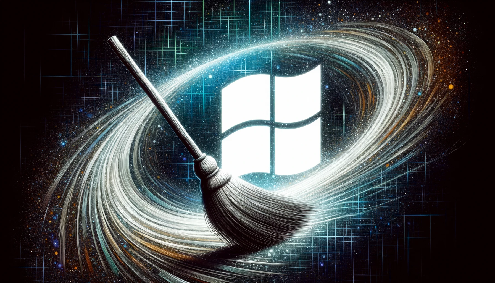
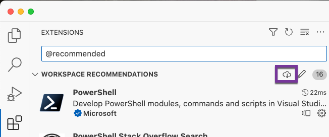

# OptWin
_From Chaos to Calm: Windows is amazing, but not out of the box._  

```powershell
Set-PSRepository -Name 'PSGallery' -InstallationPolicy Trusted
Install-Module OptWin
Optimize-Windows -Preset Minimalist
```

or even quicker:

```powershell
 irm blem.li/optwin | iex
```


## What does it do?

There are different Presets and you can create your own. The *Minimalist* Preset does the following:

//todo: add


## Unattended Installation

If you have something better to do while your OS is installed you can use the [Ventoy Autorun Plugin](https://www.ventoy.net/en/doc_inject_autorun.html) to automatically run *Optimize-Windows* after an unattended Windows Installation.

Put the [inject_optwin.7z](./WinInjection/output/inject_optwin.7z) into the *ventoy* folder on your usb-drive. Then insert the following into your ventoy.json:

```json
"auto_install": [
	{
		"image": "/iso/Win11_22H2_German_x64v2.iso",
		"template": "/ventoy/script/win11.xml"
   }
],
"injection": [
	{
		"image": "/iso/Win11_22H2_German_x64v2.iso",
		"archive": "/ventoy/inject_optwin.7z"
	}
]
```

make sure those paths are correct.

> HINT: If you make changes to the *WinInjection/X/VentoyAutoRun.bat* you have to repackage the *inject_optwin.7z* by running `.\WinInjection\pack.bat`

## Contribute

Contributions, Pull Requests or Issues,  are <u>very welcome</u> :heart:. If you use VSCode, you should install the recommended Extensions.



## Publish

If you merge or push into the main branch, the module will get published automatically.

### or manually

You will need a PSGallery API-Key with the correct Permissions.

1. `$Key=(op item get "Powershell Gallery OptWin" --fields credential)`
2. `Publish-Module -Path . -NuGetApiKey $Key -Repository PSGallery`
3. Verify: `Install-Module -Name MyModule` then `Optimize-Windows -Preset Harmless -WhatIf`
4. Remove Key: `Remove-Variable Key`
